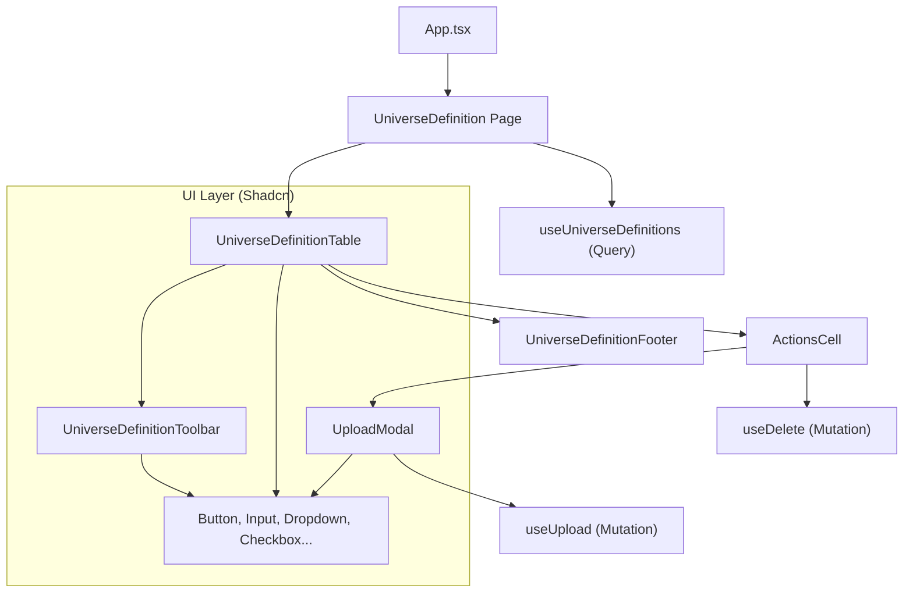

# Gemdata Task

A sample application to upload definitions and view them in a table.

## Tech Stack

- **Framework**: [React 19](https://react.dev/)
- **Build Tool**: [Vite](https://vitejs.dev/)
- **Language**: [TypeScript](https://www.typescriptlang.org/)
- **Styling**: [Tailwind CSS 4](https://tailwindcss.com/)
- **UI Components**: [Shadcn UI](https://ui.shadcn.com/) / [Base UI](https://base-ui.com/)
- **State Management**: [TanStack Query](https://tanstack.com/query/latest) (React Query)
- **Data Table**: [TanStack Table](https://tanstack.com/table/latest) (React Table)
- **Icons**: [Lucide React](https://lucide.dev/)
- **Backend Mock**: [JSON Server](https://github.com/typicode/json-server)
- **Testing**: [Vitest](https://vitest.dev/), [React Testing Library](https://testing-library.com/docs/react-testing-library/intro/)

## Component Architecture

The project follows a modular architecture with a clear separation between pages, feature components, and base UI elements.

### Component Diagram



### Folder Structure

- **`src/pages/`**: Top-level page components and their specific sub-components (like `column-defs.tsx`).
- **`src/components/`**: Feature-level components (Toolbar, Table, Modals).
- **`src/components/ui/`**: Low-level, reusable UI atoms (Shadcn/Base UI).
- **`src/queries/`**: Data fetching logic and state management using TanStack Query.
- **`src/types/`**: Project-wide TypeScript interface definitions.
- **`src/helpers/`**: Common utility functions and constants.

## How to run

Install dependencies

```bash
npm install
```

Start both the local JSON server and the Vite application with a single command:

```bash
npm run dev
```
